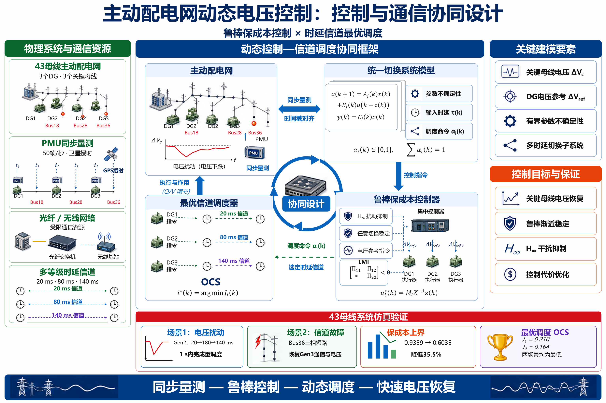
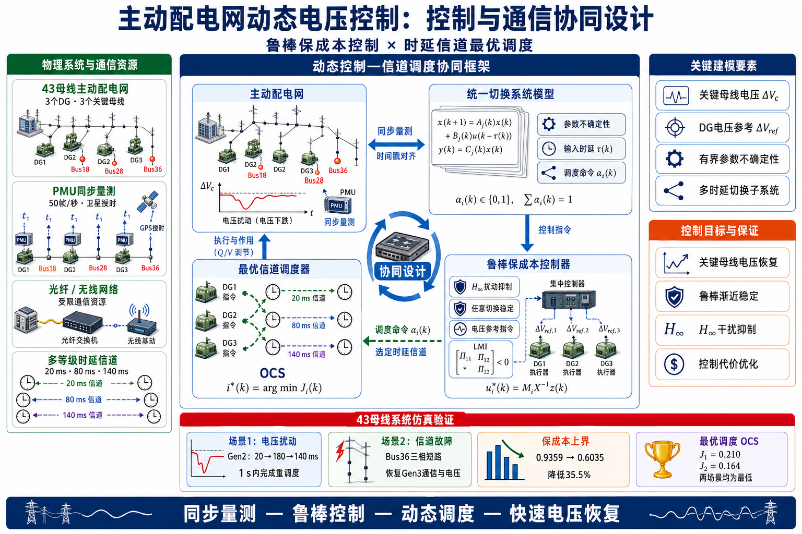

<div align="center">

<h1>PPT-editable</h1>

<p><strong>把参考图，变成还能继续修改的 PowerPoint。</strong></p>
<p>High-fidelity, image-first PowerPoint reconstruction — with editable text, native equations, and verifiable local repairs.</p>

<p>
  <a href="./LICENSE"></a>
  
  
  
</p>

<p>
  <a href="https://github.com/Layman-art/PPT-editable/releases/latest"><strong>下载完整 skill 包</strong></a>
  &nbsp; · &nbsp;
  <a href="./examples/active-grid-office-math.pptx"><strong>下载可编辑示例 PPT</strong></a>
  &nbsp; · &nbsp;
  <a href="./ppt-editable/SKILL.md">阅读 skill</a>
</p>

<p>
  <a href="#效果预览">效果预览</a> ·
  <a href="#快速开始">快速开始</a> ·
  <a href="#什么可以编辑">编辑范围</a> ·
  <a href="#怎么发给别人">分享方式</a>
</p>

</div>

<p align="center">
  
  <br><sub>真实示例的 PowerPoint 原生渲染，不是独立转换软件的界面。</sub>
</p>

> [!IMPORTANT]
> 这是供 **Codex 调用的工作流 skill**，不是独立应用，也不是一个命令就能完成任意截图转换的程序。完整路线需要可用的 **Presentations skill / 工具环境**，以及 **Windows 桌面 PowerPoint 2024**。这些运行环境和商业软件不包含在仓库中。

## 为什么做 PPT-editable？

参考图已经很好看，但一旦要改一个词、挪一条箭头、调整一个公式，整页图片就不够用了。

PPT-editable 固化的是从“图像参考”到“可编辑对象”的制作过程：先确认布局、文字和素材，再重建有意义的编辑单元，最后回到 PowerPoint 检查真实显示效果。它不承诺固定耗时或逐像素一致；**还原度、编辑性和可验证的局部修改优先**。

| 常见问题 | 工作流的处理方式 |
| --- | --- |
| 看起来像 PPT，实际上只有一张截图 | 重建文字、面板、主箭头、简单图表与公式 |
| 新文字盖住旧文字，移开后出现重影 | 放置前清理素材，不用遮挡掩盖旧内容 |
| 图标被裁掉，白底或横线很突兀 | 放大检查完整轮廓、背景和相邻残片 |
| 分数、矩阵与上下标靠文本框拼接 | 独立公式写入 Office 2024 原生 Office Math |
| 修一个地方，其他布局也跟着变化 | 只改目标对象，比较结构与目标区域外的渲染 |

## 效果预览

<table>
  <tr>
    <td width="50%" align="center">
      
      <br><sub>输入：包含文字、公式和复杂设备插画的参考图</sub>
    </td>
    <td width="50%" align="center">
      
      <br><sub>输出：独立文字、原生公式、主要连线与可移动图片素材</sub>
    </td>
  </tr>
</table>

[下载示例 PPTX](./examples/active-grid-office-math.pptx) · [示例内容与验证说明](./examples/README.md)

> 示例演示的是复刻与编辑能力，不是研究结果证明。图中的数字、物理结论和原图疑点未进行独立科学验证；引用到论文或报告前请核实。

## 快速开始

### 1. 准备运行环境

| 组件 | 用途 |
| --- | --- |
| 支持本地 skills 的 Codex | 读取参考材料并执行工作流 |
| 可用的 Presentations skill 与其工具依赖 | 创建、编辑、导出和检查 PPTX；本仓库不重新分发该环境 |
| Windows + 已安装且可用的桌面 PowerPoint 2024 | 原生公式写入、重开检查和最终渲染 |
| Python 3.10+；Pillow | 运行随附的裁图、像素对比工具；PPTX 结构审计主要使用标准库 |

独立公式保留 Office Math 数学字体，当前验证为 **Cambria Math**；中文示例使用 **微软雅黑**。不要为了“全字体统一”把结构化数学字体强改成普通文本字体。

### 2. 安装完整 skill 文件夹

最简单的方式是让 Codex 使用内置安装器，复制下面这句话：

```text
用 $skill-installer 从 https://github.com/Layman-art/PPT-editable
安装其中的 ppt-editable 文件夹。安装前检查同名 skill，不要覆盖我已有的修改。
```

也可以从 [Releases](https://github.com/Layman-art/PPT-editable/releases/latest) 下载 `PPT-editable-v1.0.0.zip`，解压后将其中的 **`ppt-editable/` 整个文件夹**放入当前 Codex 的技能目录。当前官方文档列出的用户级目录为 `~/.agents/skills/`；项目级目录为 `.agents/skills/`。如果你的现有安装使用其他受支持目录，保持原目录即可，避免同时安装两份同名 skill。见 [OpenAI 官方技能文档](https://learn.chatgpt.com/docs/build-skills)。

安装后找不到 skill 时，重新开启 Codex 会话再检查。只复制 `SKILL.md` 不完整：它还会引用 `references/` 和 `scripts/`。

需要在自己的 Python 环境中手动运行图像辅助脚本时：

```powershell
python -m pip install -r requirements.txt
```

这只安装脚本的图像处理依赖，不会安装 Codex、Presentations 工具或 Office。

### 3. 开始复刻

**已有参考图**

```text
用 $ppt-editable 把这张参考图高还原复刻成可编辑 PPT。
文字按语义块拆分，独立公式使用 Office 2024 原生公式；
复杂插画允许保留为独立图片，但图标轮廓必须完整。
```

**修复已有 PPT**

```text
用 $ppt-editable 修复这个 PPT 中指定图标的裁切和连线问题。
只修改目标区域，保留其他内容，另存新版本并验证非目标区域没有变化。
```

**从材料开始**

```text
用 $ppt-editable 根据这些材料先整理页面内容与视觉方向，
生成参考稿，确认后再制作可编辑 PPT。不要补写材料没有给出的事实。
```

更多调用模板见 [prompt-patterns.md](./ppt-editable/references/prompt-patterns.md)。

## 什么可以编辑？

| 元素 | 默认交付结构 | 怎么改 |
| --- | --- | --- |
| 标题、说明、数值 | 原生文本框，按语义块组织 | 在 PowerPoint 中直接改字 |
| 面板、主要箭头、母线、简单图表 | 原生形状与连接线 | 调整位置、样式和连接关系 |
| 独立公式、分式、矩阵 | Office Math（OMML / MathZone） | 进入 PowerPoint 公式编辑，不依赖 MathType |
| 中文标签里的少量数学变量 | 版式稳定时保留真实上下标文本 | 直接修改文字；不把整个标签强行公式化 |
| 复杂设备、插画、精细图标 | 经清理的独立图片 | 可移动、缩放、替换；内部像素不是独立对象 |

公式验证同时查看 PPTX 中的 `a14:m / m:oMath` 和保存重开后的 `MathZones(1,1)`。只看字体、截图或对象数量，不足以证明它是真正的公式。

## 随附工具

这些脚本辅助 Codex 工作，**不是复刻主程序，也不包含通用公式批量生成器**。实际页面构建和公式写入由执行任务时的代理根据当前材料完成。

| 脚本 | 作用 |
| --- | --- |
| `audit_pptx.py` | 按任务自定义 JSON 合约审计 PPTX 结构与媒体 |
| `crop_reference_assets.py` | 批量裁图，报告触边和颜色污染风险 |
| `compare_renders.py` | 比较原生渲染，区分允许修改区域与非目标区域 |
| `compare_pptx_semantics.py` | 比较对象、媒体和包内变化；不等于完整解析所有 Office 功能 |
| `render_powerpoint_native.ps1` | 调用桌面 PowerPoint 导出真实页面 PNG |

运行前可用 `python ppt-editable/scripts/audit_pptx.py --help` 查看参数。合约格式与示例见 [qa-contract.md](./ppt-editable/references/qa-contract.md)。

> [!NOTE]
> 原生渲染前请保存并关闭已打开的 PowerPoint。本公开版渲染器检测到已有 PowerPoint 进程会拒绝运行；运行中也不要同时操作 PowerPoint。裁图与报告请使用新的输出目录，分享报告前清理其中可能记录的本地绝对路径。

## 怎么发给别人？

| 对方想要什么 | 发什么 |
| --- | --- |
| 使用这套复刻 workflow | **`PPT-editable-v1.0.0.zip`**：包含完整 skill、README 和示例 |
| 只阅读 skill 源码、参与维护 | GitHub 仓库链接，或仓库的 Source code ZIP |
| 只看或修改本次示例 | **`active-grid-office-math.pptx`**；图片已嵌入，不需要另附素材文件夹 |

拿到 skill ZIP 并不等于拿到运行环境。对方仍需准备上面的 Codex / Presentations / PowerPoint 条件。只看示例 PPT 不需要安装本 skill 或 MathType；其他软件对 Office Math 的显示与编辑兼容性未作保证。

## 项目结构

```text
ppt-editable/        可安装的完整 skill 文件夹
  SKILL.md          工作流入口与质量规则
  agents/           Codex 显示和调用元数据
  references/       复刻、交接、校验和提示词模板
  scripts/          裁图、结构审计、渲染与差异检查
examples/           可编辑 PPTX 及示例说明
docs/assets/        README 的参考图与真实渲染
requirements.txt    图像辅助脚本所需依赖
LICENSE             MIT 许可证
```

## 边界、隐私与贡献

- 以参考图和用户明确要求为准，不承诺每次逐像素一致或固定完成时间。
- 结构检查通过不等于视觉质量通过，最终仍要做 PowerPoint 原生渲染与局部放大检查。
- 文件在本地保存不代表完全离线：使用云端模型、图像生成或外部工具时，数据边界取决于该服务。不要提交未经授权的敏感材料。
- 本仓库不分发 Office、MathType、商业字体、Codex 内部运行库或其他软件授权。
- 欢迎提交 Issue / PR。反馈请附最小可公开参考图、预期效果和 PowerPoint 版本，勿上传私人路径、密钥或未获授权资料。

采用 [MIT License](./LICENSE)，与 [Research Workbench](https://github.com/Layman-art/Research-Workbench) 一致。示例来源及使用边界见 [examples/README.md](./examples/README.md)；许可证不授予第三方商标、字体或其他第三方内容的额外权利。
