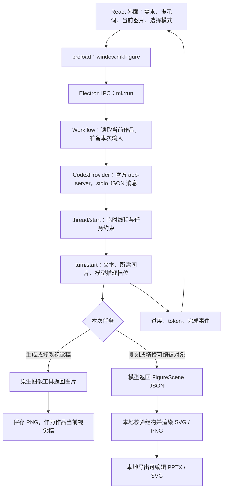

# MK Figure 的数据流与模型调用

核对日期：2026-09-19。以下说明以本仓库实际实现为准。

## 为什么 Codex 侧边栏里没有对话

MK Figure 调用的是官方 Codex App Server，但没有在 Codex 桌面界面中代发消息。每次模型操作都会启动一个独立的 `codex app-server --listen stdio://` 子进程，并创建 `ephemeral: true` 的临时线程。完成后关闭这个子进程。因而不能在 Codex 桌面的常规历史列表中查到这段临时会话。

这不表示没有请求模型：请求经过官方 Codex 运行时，使用其当前登录账户。界面里的模型名称、耗时和 token 来自这次调用及服务器返回事件。官方文档区分了内存中的临时线程与可通过 `thread/list` 获取的持久化线程，协议也提供 `model/list` 的推理档位和 `turn/start` 的 `effort` 参数。[官方 App Server 文档](https://learn.chatgpt.com/docs/app-server)

各步骤之间主要由 MK Figure 本地作品文件衔接，不是同一聊天里不断追加消息。后续步骤会按需要重新附上当前图片、文字说明或可编辑图形数据。因此不能假定模型记得某个步骤没有重新发送的内容。

## 从点击按钮到导出文件

| 环节 | 实际代码 | 作用 |
|---|---|---|
| 界面按钮 | `src/renderer/App.tsx` | 保存正在编辑的表单，再调用 `run(projectId, action, feedback)`。 |
| 桥接 | `src/main/preload.ts` | 只向页面暴露明确的 `window.mkFigure` 方法；界面不直接读文件或调用 Codex。 |
| 入口校验 | `src/main/main.ts` | 通过 `mk:*` IPC 校验调用来源和项目 ID，转交工作流。 |
| 任务编排 | `src/main/workflow.ts` | 选择本次资料、参考图或原图，组装提示词，保存结果和运行指标。 |
| Codex 协议 | `src/main/providers/codex.ts` | 启动运行时、建立临时线程、发送文本和图片，读取流式结果。 |
| 可编辑图形 | `src/core/schema.ts`、`svg.ts`、`pptx.ts` | 验证图形坐标与类型，分别生成 SVG 和 PowerPoint 原生对象。 |
| 持久化 | `src/main/storage.ts`、`assets.ts` | 保存作品、导入材料、图片、提示词和运行记录。 |

App Server 本机通信采用标准输入/输出，不经过 MK Figure 自建中转服务器。模型推理和图像工具仍使用在线服务；附给本次任务的文本、图像会随该请求交给服务。MK Figure 通过官方运行时使用登录态，不在自己的设置文件里复制 OAuth token。

## 首次生成不满意时，三种选择发送什么

| 用户选择 | 发送给 GPT / 图像工具的内容 | 是否先让 AI 整理意见 |
|---|---|---|
| 直接改图：`edit-image` | 当前图片 + 用户填写的修改提示词。当前图明确作为待修改原图。 | 否 |
| 按意见改图：`refine-image` | 先用当前图片 + 修改意见得到明确编辑指令，再用同一原图 + 该指令修改。 | 是；增加一次文本模型调用 |
| 仅按提示词重画：`regenerate-image` | 新提示词；不附当前图片、原来的风格参考图或旧需求。 | 否 |

用户自行选择是否以当前图为基础，以及是否先让 AI 整理修改意见。当前实现的两种“改图”均不自动叠加旧风格参考；“重画”需要提示词自身交代想保留的内容。原来的视觉稿留在作品的生成记录里，新结果成为当前视觉稿。

首次 `generate` 与上表不同：它会本地组合主题、重点、资料文本、语言、画幅、风格要求及手写提示词，并附上已选风格参考。`prompt` 是单独的可选 AI 提示词优化步骤，首次生成不强制先执行它。

## 哪些资料会被读取、发送和保存

- 导入 PDF 时本地提取文字和页码；导入 PPTX 时本地提取幻灯片文字。它们不会因为导入就自动完成图表、公式的视觉阅读；扫描页或复杂公式需另给图片或核对说明。每份提取文本最多保留 150,000 字符，工作流汇总来源文本最多 180,000 字符。
- 资料整理 `analyze` 可附上最多 4 张导入的图片资料；风格参考、生图、改图、复刻分别按其任务选择图片。不是把整个素材库或电脑目录发送出去。
- 复刻发送当前目标图片和相关文字需求，要求返回 `FigureScene`。模型返回的 JSON 经本地规范化和校验；若结构无效，工作流最多追加一次格式修复请求。模型不会直接创建最终 `.pptx` 文件。
- 图中文字、公式的文字与线条、图形和箭头按场景对象导出。公式用衬线文字组件，不用 Office Math。全矢量模式禁止场景中的位图对象。
- Windows 默认数据目录为 `%APPDATA%/MK Figure`；macOS 默认沿用 Electron 的用户数据目录。测试通过 `MK_FIGURE_DATA_DIR` 使用单独目录，不改真实作品。
- 单个作品包含 `project.json`、`assets/`、`generation/`，复刻后还有 `preview.svg`、`preview.png`。改图记录的 `generation/operation-*.json` 保存实际动作、提示词、模型、档位及原图/结果标识，便于排查；它不包含原始登录凭据。
- 用户导出仅写所选的 PPTX / SVG / PNG。内部项目 JSON 和操作记录不会作为额外导出文件送进用户选择的导出目录。

## Skill 与软件代码分别起什么作用

仓库根目录的 `mk-figure-skill/` 是唯一可安装 skill；打包时复制到软件资源目录 `skill/`。当前运行时代码不会读取其中的整篇 `SKILL.md` 并依次执行；Codex 进程还明确关闭了主机 skill 自动发现。实际送给模型的是：

1. `generation-prompt.ts` 中本地组合的生图提示词。
2. `workflow.ts` 中各动作的任务说明，以及复刻时的 `SCENE_INSTRUCTIONS`。
3. `codex.ts` 中创建/编辑图片的任务约束和线程基础说明。
4. 用户本次填写的内容，以及该动作明确选择的图像或资料。

所以只修改 skill 文案，并不会自动改变软件的模型行为；两处需要同步维护。原 `PPT-editable` 的 PPT 专项流程已整合进唯一 skill，但不是本应用的运行依赖，也没有被作为另一套 skill 调用。软件自己的 `FigureScene → SVG/PPTX` 实现承担可编辑复刻和导出。

## “低推理”测试能说明什么

模型列表来自账户实时 `model/list`，使用其支持的 `low` 档位，而不是假定所有模型都支持。设置的 `low` 发给 `turn/start.effort`，控制 GPT 任务推理；内部原生图像工具具体模型和独立推理档位并未由此确认。[官方参数说明](https://learn.chatgpt.com/docs/app-server)

本轮测试入口是 `scripts/low-reasoning-eval.mjs`，默认只做账户/模型只读探测；`--execute` 才执行限次真实调用。测试使用独立数据目录和同一份五模块 Neural ODE 内容，逐步保存视觉稿、修改后图片、可编辑预览、请求记录、耗时和服务器返回的 token。未返回的 token 不估算；不把 token 数换算成 Plus 剩余额度。

2026-09-19 的只读探测显示当前账户 `planType=pro`，当前配置 `gpt-6-astra/high`，该模型支持图片输入和 `low`。测试会在隔离配置中使用 `gpt-6-astra/low`。这只能验证当前 Pro 账户的低推理表现，不能称为 Plus 账户实测，不能据此推算 Plus 配额或完成率。少量成功样本也不能保证复杂信息图同样稳定。
